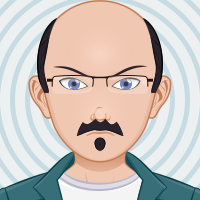
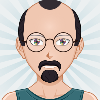
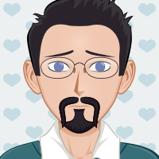
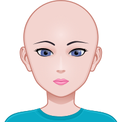
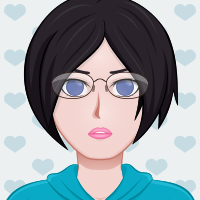

# Avatar Maker

Generate random avatar images (in SVG format).

Inspired from [Free Avatar Maker](https://avatarmaker.com/).

## Installation

```bash
# Using yarn
yarn add @tdrmk/avatarmaker

# Using npm
npm install @tdrmk/avatarmaker
```

## Usage

Generate a random image (gender chosen at random).

```js
const { generateAvatar } = require("@tdrmk/avatarmaker");

// generate a random avatar
const { svg } = generateAvatar();

// logs the svg image
console.log(svg);
```

Generate a random image with specified gender (`male` or `female`).

```js
const { generateAvatar } = require("@tdrmk/avatarmaker");

// generate a random male avatar
const { svg } = generateAvatar({ gender: "male" });

// logs the svg image
console.log(svg);
```

Obtain features from generated image

```js
const { generateAvatar } = require("@tdrmk/avatarmaker");

// generate a random avatar
const { svg, chosen_zones } = generateAvatar();

// logs the chosen features
console.log(chosen_zones);

// logs the svg image
console.log(svg);
```

Generate an image with specified features

```js
const { generateAvatar } = require("@tdrmk/avatarmaker");

const chosen_zones = {
  backs: 7,
  clothes: 1,
  ears: 3,
  faceshape: 9,
  mouth: 14,
  eyesiris: 5,
  eyesfront: 8,
  eyebrows: 3,
  nose: 1,
};

// generate a random avatar
const { svg } = generateAvatar({ gender: "male", chosen_zones });

// logs the svg image
console.log(svg);
```

All available features

```js
const chosen_zones = {
  backs: 1,
  hairback: 13,
  humanbody: 0,
  chinshadow: 5,
  clothes: 11,
  ears: 6,
  faceshape: 11,
  mouth: 13,
  eyesback: 2,
  eyesiris: 7,
  eyesfront: 0,
  facehighlight: 0,
  eyebrows: 10,
  nose: 2,
  beard: 8,
  mustache: 11,
  hairfront: 13,
  glasses: 2,
};
```

### Generating random avatar images

```bash

npx avatarmake > output.svg

```

## Sample images

Some randomly generated images













